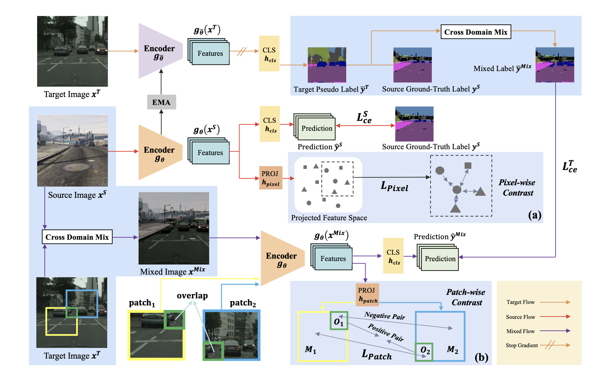

<div align="center">    
 
# PiPa: Pixel- and Patch-wise Self-supervised Learning for Domain Adaptative Semantic Segmentation


**by [Mu Chen](https://scholar.google.com/citations?hl=en&user=eyBlZUUAAAAJ), [Zhedong Zheng](https://zdzheng.xyz/), [Yi Yang](https://scholar.google.com.au/citations?user=RMSuNFwAAAAJ&hl=en), 
and [Tat-Seng Chua](https://scholar.google.com.sg/citations?user=Z9DWCBEAAAAJ&hl=en)**
</div>

**Update at 14/11/2022, ArXiv Version of [PiPa](https://arxiv.org/abs/2211.07609) is available.**

**Update at 13/12/2022, Code and Checkpoints release**

## Overview
Unsupervised Domain Adaptation (UDA) aims to enhance the generalization of the learned model to other domains. The domain-invariant knowledge is transferred from
the model trained on labeled source domain, e.g., video
game, to unlabeled target domains, e.g., real-world scenarios, saving annotation expenses. Existing UDA methods for semantic segmentation usually focus on minimizing
the inter-domain discrepancy of various levels, e.g., pixels,
features, and predictions, for extracting domain-invariant
knowledge. However, the primary intra-domain knowledge,
such as context correlation inside an image, remains underexplored. In an attempt to fill this gap, we propose a unified pixel- and patch-wise self-supervised learning framework, called PiPa, for domain adaptive semantic segmentation that facilitates intra-image pixel-wise correlations and
patch-wise semantic consistency against different contexts.
The proposed framework exploits the inherent structures
of intra-domain images, which: (1) explicitly encourages
learning the discriminative pixel-wise features with intraclass compactness and inter-class separability, and (2) motivates the robust feature learning of the identical patch
against different contexts or fluctuations.


## Installation

In this project, we used python 3.8.5

```shell
conda create --name pipa -y python=3.8.5
conda activate pipa
```

Then, the requirements can be installed with:

```shell
pip install tensorboard

pip install -r requirements.txt -f https://download.pytorch.org/whl/torch_stable.html
pip install mmcv-full==1.3.7  # requires the other packages to be installed first
```

Further, download the MiT weights from SegFormer using the
following script.

```shell
sh tools/download_checkpoints.sh
```

## Prepare Data

Download [GTA5], [Synthia] and [Cityscapes] to run the basic code.

**Cityscapes:** download leftImg8bit_trainvaltest.zip and
gt_trainvaltest.zip from [here](https://www.cityscapes-dataset.com/downloads/)
and extract them to `data/cityscapes`.

**GTA:** download all image and label packages from
[here](https://download.visinf.tu-darmstadt.de/data/from_games/) and extract
them to `data/gta`.

**Synthia:** download SYNTHIA-RAND-CITYSCAPES from
[here](http://synthia-dataset.net/downloads/) and extract it to `data/synthia`.

The data folder is structured as follows:

```none
PiPa
├── ...
├── data
│   ├── cityscapes
│   │   ├── leftImg8bit
│   │   │   ├── train
│   │   │   ├── val
│   │   ├── gtFine
│   │   │   ├── train
│   │   │   ├── val
│   ├── gta
│   │   ├── images
│   │   ├── labels
│   ├── synthia
│   │   ├── RGB
│   │   ├── GT
│   │   │   ├── LABELS
├── ...
```

**Data Preprocessing:** Finally, please run the following scripts to convert the label IDs to the
train IDs and to generate the class index for RCS:

```shell
python tools/convert_datasets/gta.py data/gta --nproc 8
python tools/convert_datasets/cityscapes.py data/cityscapes --nproc 8
python tools/convert_datasets/synthia.py data/synthia/ --nproc 8
```


## Testing

We provide pretrained models below for PiPa based on hrda.

### 

| model name                       | mIoU  | checkpoint file download                    |
| :------------------------------- | :---: | :------------------------------------- |
| pipa_gta_to_cs.pth  | 75.6  | [Google Drive](https://drive.google.com/file/d/1YhhVtuODGl3vCcE5wvWf8kwvMOSr4QaU/view?usp=share_link)|
| pipa_syn_to_cs.pth  | 68.2  | [Google Drive](https://drive.google.com/file/d/1m4bhr52tLmLwBTpHY9sA_kyH_IviajQi/view?usp=share_link)|


```shell
python -m tools.test path/to/config_file path/to/checkpoint_file --format-only --eval-option 
```

## Training

```shell
python run_experiments.py --config configs/pipa/gtaHR2csHR_hrda.py
```

The logs and checkpoints are stored in `work_dirs/`.

## Acknowledgements

We thank the authors of the following open-source projects for making the code publicly available.

* [HRDA](https://github.com/lhoyer/HRDA)
* [DAFormer](https://github.com/lhoyer/DAFormer)
* [MMSegmentation](https://github.com/open-mmlab/mmsegmentation)
* [SegFormer](https://github.com/NVlabs/SegFormer)
* [DACS](https://github.com/vikolss/DACS)
* [Seg-Uncertainty](https://github.com/layumi/Seg-Uncertainty)

## Citation

If you find this work helpful to your research, please consider citing the paper:

```bibtex
@article{chen2022pipa,
  title={PiPa: Pixel-and Patch-wise Self-supervised Learning for Domain Adaptative Semantic Segmentation},
  author={Chen, Mu and Zheng, Zhedong and Yang, Yi and Chua, Tat-Seng},
  journal={arXiv preprint arXiv:2211.07609},
  year={2022}
}
```
